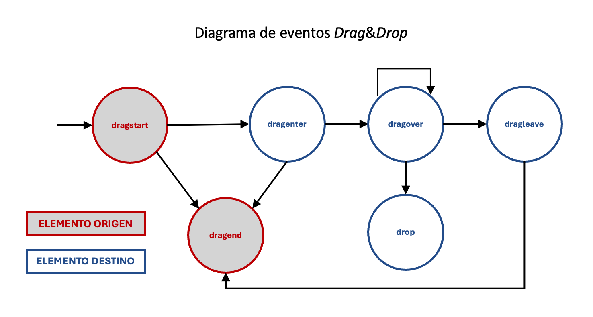
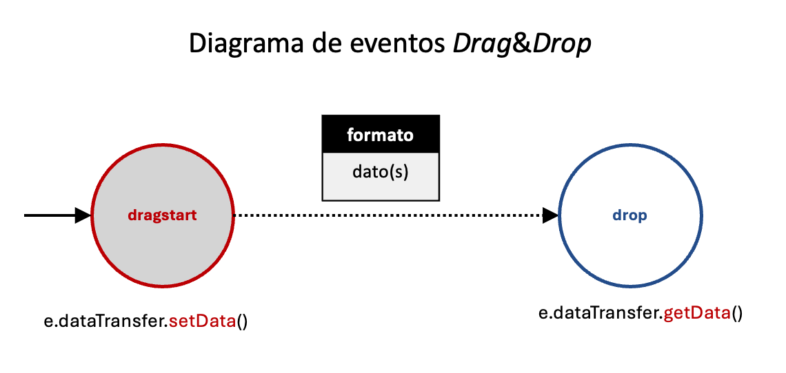

# Drag & Drop

La API Drag And Drop (arrastrar y soltar) permite reubicar elementos de una página.

## Origen y destino

Esta operación involucra dos tipos de elementos: origen (arrastrables) y destino de la operación.

*Elementos origen (arrastrables)*: Los elementos que pueden ser arrastrados deben incluir el atributo draggable con valor true

              
....

Se dispone de dos eventos aplicables a los elementos arrastrables: 
    -- dragstart: Comienzo del arrastre de un elemento draggable
    -- dragend: Cancelación del arrastre de un elemento draggable. La gestión de este evento es opcional. 

*Elementos destino*: Para identifica un elemento HTML como destino de una operación Drag&Dropo tenemos que asociarle gestores para los siguientes eventos: 
    
    -- dragover: Indica que un elemento arrastrable esta dentro (sobre) el elemento 
    -- drop: El elemento arrastrable se ha soltado en el elemento, i.e. la operación de arrastre ha concluido.   
    -- dragleave: Señala que un elemento arrastrabe ha entrado dentro del elemento
    -- dragenter: Señala que un elemento arrastrabe ha salido del elemento

### Aclaraciones:

## Diagrama de eventos

La operación comienza seleccionando un elementos arrastrable (evento dragstart). A partir de aquí se puede desplazar el elemento con
dos posibilidades: 
- si se suelta en un elmento que no es destino se desencadena el evento dragend: la operación se cancela sin efecto ninguno
- si se desplaza hacia un elemento que es destino, si no se suelta el elemento arrastrable, pueden sucederse tres eventosstado (dragenter, dragover, dragleave) según el elemento arrastrable entre, se mantenga o salga de la zona ocupada por el elemento destino.
- para que se desencadena el evento drop, el elemento arrastrable debe soltarse cuando está efectivamente dentro de la zona ocupada por el elemento destino. En otro caso en vez del evento drop, se desencadena el evento dragend.

Resumiendo: 
- Los eventos cruciales que determinan el ciclo de una operación Drag&Drop son dragstar y drop
- El comportamiento de dragover es de naturaleza reiterativa: se lanza sucesivamente mientras el elemento arrastrable está dentro del elemento
- Los eventos dragenter y dragleave preceden y suceden a los eventos dragover
- El evento drop exige que antes suceda el evento dragover, pues para soltar un elemento arrastrable es necesario que esté sobre el elemento destino

## Gestión de los eventos

- Es frecuente acompañar la operación de Drag&Dropo con cambios de estilos en los elemento involucrados para ayudar a visualizar la operación.
La estrategia más recomendada es asociar atributos class a los elementos origen y destion para definir estilos CSS que serán manipulados en los gestores de eventos mediante la propiedad .classList. De esta forma se independizan HTML, CSS y JS.
-Salvo para cambios de estilos, no suele ser estricatmente necesaria la gestión de los eventos (dragenter, dragleave y dragend)
- Hay elementos HTML que tienen una respuesta por defecto ante acciones de soltado. Pero en general, la mayoría de los elementos HTML 
rechazan por defecto las operaciones de soltado. Para evitar estos comportamientos, la estrategia recomendada es:
  -- incluir preventDefault() en los gestor de eventos dragover. De esta forma informamos al elemento que debe responder al evento drop según lo indicado en el gestor definido. 
  -- incluir preventDefault() en los gestores de eventos drop. Algunos navegadores responden de forma automática con la apertura de archivos o la redirección de la navegación. Por precuacución es aconsejable añadir preventDefault() (o stopPropagation()) para evitar dicho comportamiento.

## Transferencia
El objeto _dataTransfer_ se emplea para la transferencia de datos en operaciones interactivas. 

Es el mecanismo más recomendado de transferencia cuando se emplea la API Drag&Drop en situraciones donde se necesita trasladar o comunicar información desde el elemento origen al destino.

El caso más común es el siguiente. La transferencia involucra dos momentos de la interacción:

- Evento dragstart (Comienzo de la operación): El elemento que da origen a la operación de arrastre almacena (setData) la información a transferir

              const dato = .....
              event.dataTransfer.setData(formato,dato)

- Evento drop (Fin de la operación): El elemento donde se culmina la operación de arrastre recupera (getData) la información transferida
      
                dato=event.dataTransfer.getData(formato)

El objeto de transferencia (dataTransfer) tiene las siguientes particularidades:

- Es un objeto temporal vinculado a la operación: se crea al comenzar el arrastre y se destruye al soltarlo.
- El objeto exige que se indique el formato de la información transferida (se usa notacion MIME). 
- Los dos formatos más habituales son: 
  -- text/plain para cadenas (incluye el caso de números representados mediante cadenas)
  -- application/json para objetos. Los objetos son transferidos mediante su conversión a objetos JSON y recibidos mediante su reconversión de objetos JSON a objetos JS. Para tal fin se usan los métodos  JSON.stingfy() y JSON.parse()
- Se puede crear **sólo** un objeto para cada formato, i.e. no podemos enviar dos cadenas (text/plain), en este caso habría que mandar un objeto con dos cadenas. 

NOTAS: 
- Existe una operación dataTransfer.clearData(fomato) para destruir en el momento que se desee la transferencia
- La transferencia de información, en los casos más simples, puede ser realizada mediante una variable global compartida por los manejadores de
  los eventos drapstart y drop. La ventaja de usar dataTransfer se evidencia en casos de interacción más complejos como cuando se realiza entre dos documentos o cuando intervienen elementos iframe. 

## Ejemplos

Se incluyen dos ejemplos:

- drag&drop: Muestran los distintos eventos de la API Drag&Drop:
    -- Se muestra por consola los eventos desencadenados
    -- Se aplican estilos para hacer más comprensible la interacción
- dataTransfer: Transferencia combinada de una cadena (formato text/plain) y un objeto (formato application/json)

## Referencias

[MDN](https://developer.mozilla.org/en-US/docs/Web/API/HTML_Drag_and_Drop_API)
[MDN](https://developer.mozilla.org/en-US/docs/Web/API/DataTransfer)
[MDN](https://developer.mozilla.org/en-US/docs/Web/API/HTMLElement/style)

Para tener una visión más completa sobre estilos dinámicos:
[MDN](https://developer.mozilla.org/en-US/docs/Web/API/CSS_Object_Model/Using_dynamic_styling_information)

Para tener una visión más clara de Drag&Drop (y apoyada con ejemplos)
[Webdev](https://web.dev/drag-and-drop/)
